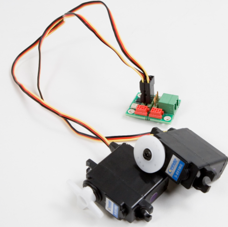

# Carte SERVO

Carte de commande de deux servomoteurs de modélisme utilisé dans le cadre du concours de robotique Eurobot 2007 à la HEIG-VD.

La carte est articulée autour d'un microcontrôleur Silabs 8-bit C51 et dialogue en I2C avec un contrôleur Linux.